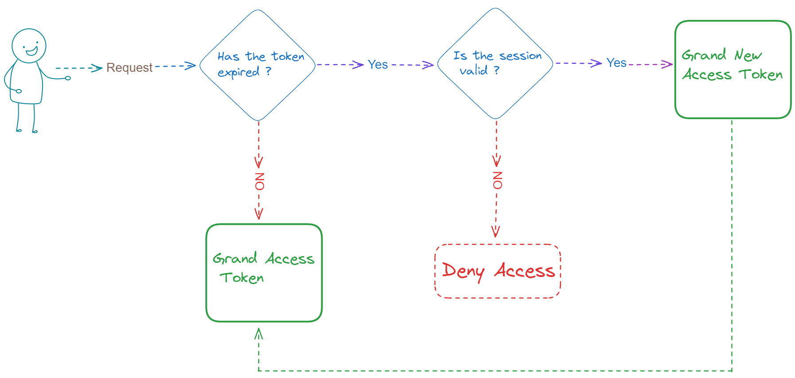

## Introduction

If you’re familiar with Node.js basics, start by running the code. As you explore and read the comments, you’ll gradually understand how it works.
___________

### [**1. Perfect Boilerplate For Starting The Project**](https://github.com/Subham-Maity/auth_advance/tree/2850177ad4eafe1679648ee9bf7140e7b6a1de5b)

  ⁙⫸ This boilerplate is perfect for starting a project without any `schema`, `controller`, `routes`,
  or `authentication`.


#### **Getting Started**:

1. **Setup**: Rename the `.env.example` to `.env` and replace the `MONGO_URL=""` with your own MongoDB URL.
2. **Installation**: Run `npm install` or `yarn install` to install the necessary dependencies.
3. **Running the Project**: Use `npm run dev` or `yarn dev` to start the project.

#### **Additional Information**:

  - If any dependency is missing, install it manually.
  - If any dependency needs to be updated, update it manually or use `npm outdated` or `yarn outdated` to check the
  outdated dependencies. Then use `npm update` or `yarn update` to update the dependencies.
  - You can change the port number in the `.env` file as per your requirements.

_______


### [**2. Cookie-based Proper Authentication with Server Token (Stateful)**](https://github.com/Subham-Maity/rest_advance/tree/98c41fb3375e4f0aa9a7f04e0d807582ca2aa54e)


⁙⫸ With Authentication + User Operations
#### **Understanding the Flow**:
- Receive an email and password from the user.
- Hash the password for security.
- Save the email and hashed password in the database.
- When the user logs in with their email and password, verify the credentials.
- If the credentials are valid, generate a session token.
- Send the session token to the client.
- The client stores the token and sends it back in the header for subsequent requests.
- For each request, verify the session token.
- If the token is valid, process the request and send the data to the client.

#### **Contents**:

- **User Schema (Mongoose)**: Includes `email`, `username`, and `authentication` (which consists of `password`, `salt`,
  and `sessionToken`).
- **User Type Defined**
- **Middleware**: This includes two types:
    - **Owner**: Ensures the user is the owner of the account.
    - **Authenticated**: Ensures the user is authenticated.
    - **Error Handler**: Handles the error.
- **Utils**: This includes crypto for salt and hash password and generate session token.
- **Controller**: This includes `auth` (with `register` and `login` methods) and `User` (
  with `getAllUser`, `updateUserById`, and `deleteUserById` methods).

#### **Routes**:

- **Auth**
    - `register`: POST request to `http://localhost:{your_port}/api/v1/auth/register`
        - Example body:
      ```json
      {
        "email": "subham@gmail.com",
        "password": "Subham@123#86!GitHub_DeVeLoPeR",
        "username": "Subham"
      }
      ```
    - `login`: POST request to `http://localhost:{your_port}/api/v1/auth/login`
        - Example body:
      ```json
      {
        "email": "subham@gmail.com",
        "password": "Subham@123#86!GitHub_DeVeLoPeR",
        "username": "Subham"
      }
      ```
- **User**
    - `getAllUser`: GET request to `http://localhost:{your_port}/api/v1/users`. This is wrapped with
      the `authentication` middleware, so you need to log in first to get the data.
    - `updateUserById`: PATCH request to `http://localhost:{your_port}/api/v1/users/{id}`. This is wrapped with
      the `authentication` and `owner` middleware, so you need to log in first to update the data.
        - Example body:
      ```json
      {
        "username": "XAM"
      }
      ```
    - `deleteUserById`: DELETE request to `http://localhost:{your_port}/api/v1/users/{id}`. This is wrapped with
      the `authentication` and `owner` middleware, so you need to log in first to delete the data.


________


### [**3. JWT-based Authentication with Access Tokens & Refresh Tokens (Stateless)**]()
### Frontend: [**Next.js**](https://nextjs.org/) + Backend: [**Express.js**](https://expressjs.com/)
#### **Introduction**:
- **Access Token**: A short-lived token that is used to access protected resources on behalf of the user.
- **Refresh Token**: A long-lived token that is used to refresh the access token when it expires.
- **JWT** - JWT is a string that has three parts separated by dots. Each part is a base64url encoded string of the header, payload, and signature.
  - JWT - `HEADER`.`PAYLOAD`.`SIGNATURE`
     
    - `HEADER` - "alg": "HS256", "typ": "JWT"
    - `PAYLOAD` - sessionID: "1234567890", "email": "subham@gmail.com", "username": "Subham"(Don't store sensitive data like password)
    - encodedPayload = Buffer.from(JSON.stringify(payload)).toString('base64')
    - `SIGNATURE` - crypto.createHmac('sha256', secret).update(encodedHeader + '.' + encodedPayload).digest('base64')
#### **Understanding the Flow**:

⁙⫸ With Authentication + User Operations

#### **Understanding the Flow**:

- User logs in with their credentials (username, password, etc.).
- Server verifies the credentials. If they're valid, the server generates an Access Token and a Refresh Token.
- The Access Token is a short-lived token (usually about 15 minutes to 1 hour) that carries the user information necessary to access a resource.
- The Refresh Token is a long-lived token (usually about 2 weeks to 6 months) that's used to request new Access Tokens.
- The Server sends both tokens to the client.
- Client stores the tokens. The Access Token is used for making authenticated requests.
- When the Access Token expires, the client uses the Refresh Token to request a new Access Token.
- Server verifies the Refresh Token and issues a new Access Token (and possibly a new Refresh Token).
- If the Refresh Token is expired or invalid, the user will need to authenticate again to get a new pair of tokens.
#### **Instructions**:

You will get two folders[`Stateful` , `Stateless`] in `model`,`middleware`,`routes`,`utils` and `controller` folder. 
- **Stateful**: This is the cookie-based authentication with server token.
- **Stateless**: This is the JWT-based authentication with access token and refresh token.

*purpose* : To understand the difference between stateful and stateless authentication.

#### **Contents**:

- `Client`: This includes our frontend code using Next.js 14
- `Server`: Here you will get all the server-side code.

##### `Client`:
- Components 
  - Username(User name set) - Formik Validation,Toast(intialValues,validate), Error Handling(yup), Types(validation.ts) 
  - Password(Password set)—Formik Validation,Toast(intialValues,validate), Error Handling(yup), Types(validation.ts)
  - Recovery(OTP to reset password) 
  - Reset(Reset Password) - Formik Validation,Toast(intialValues,validate), Error Handling(yup), Types(validation.ts)
  - Register (Register User) - Convert — converts the file to a Base64 string , Formik Validation,Toast(intialValues,validate), Error Handling(yup), Types(validation.ts)
  - Profile - Convert — converts the file to a Base64 string , Formik Validation,Toast(intialValues,validate), Error Handling(yup), Types(validation.ts)