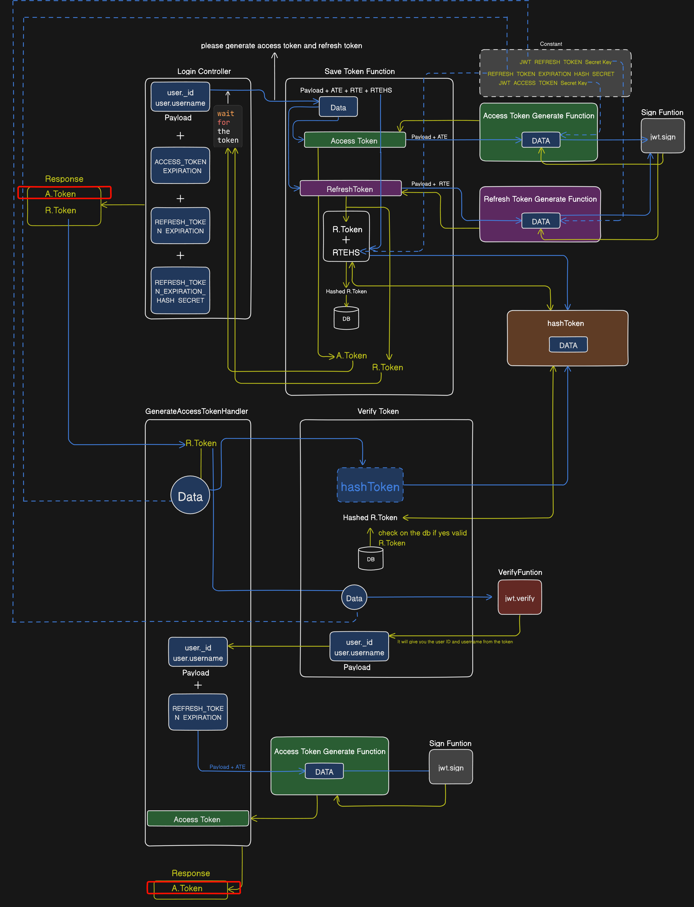

1. **generateAccessToken**: This function generates an access token using the payload (an object containing user details) and a secret key. It uses the `jwt.sign()` method to create a JSON Web Token (JWT) using the payload and the secret key. The JWT is then returned by the function.

2. **generateRefreshToken**: Similar to `generateAccessToken`, this function generates a refresh token. It also takes a payload and an expiration time as inputs. The function uses the `jwt.sign()` method to create a JWT using the payload and a different secret key. The JWT is then returned by the function.

3. **hashToken**: This function now takes two parameters: the refresh token and a secret key. It creates a hash of the refresh token and the secret key using the `crypto.createHmac()` method. The hashed token is then returned by the function.

4. **saveToken**: This function first generates the access and refresh tokens using the `generateAccessToken` and `generateRefreshToken` functions. It then creates a hash of the refresh token using the `hashToken` function and the secret key. The function checks if the user already has a refresh token in the database, and if so, deletes it. The function then saves the new hashed refresh token in the database.

5. **verifyRefreshToken**: This function first creates a hash of the incoming refresh token using the `hashToken` function and the secret key. It then checks if the hashed token exists in the database. If it does, the function uses the `jwt.verify()` method to verify the refresh token using the secret key. If the token is valid, the function returns the token details.

By adding a secret key to the hashing process, you're enhancing the security of your application. Even if two users have the same refresh token, their hashed tokens will be different because the secret keys are unique. This makes it more difficult for an attacker to reverse-engineer the token from the hash. Remember to keep your secret key secure and never expose it in your code or version control system. It's often a good idea to store secrets in environment variables or some form of secure secret management system. Always ensure to follow the latest security standards and practices when dealing with user authentication and authorization.