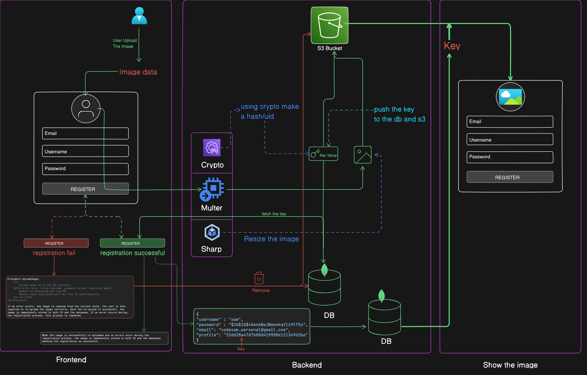

### File Upload and User Registration Process:

#### Frontend:
1. **File Upload:** Users submit an image via the registration form.
2. **Transmission:** The uploaded file is sent from the frontend to the server.

#### Backend (Server):
3. **File Handling:** Multer on the server receives and processes the uploaded file.
4. **Image Processing:** Sharp is used to resize the image as needed.

#### Backend (Processing and Storage):
5. **Storage Process:** The processed image and a secure key (generated through crypto) are sent to an S3 bucket.
6. **URL Retrieval:** The resulting URL of the uploaded image is obtained from S3.

#### Backend (Database Interaction):
7. **Key Storage:** Only the secret key is saved in the database.
8. **Key Transmission:** The profile key is immediately sent back to the user.

#### Frontend:
9. **Display Image:** Using the received profile key, the frontend requests and displays the user's image from the S3 bucket.

#### Backend (Validation):
10. **User Data Validation:** Upon correct email, password, and username, the image key is associated with the user data and stored in the database.

#### Error Handling:
11. **Error Management:** If a registration error occurs, the image from S3 is promptly deleted, along with its associated key in the database. The frontend image upload state is cleared.

#### User Retry:
12. **Retry Process:** Users must re-upload the image along with accurate data.
13. **Image Re-upload:** Upon re-upload, the image is saved to S3 again, and its corresponding key is retrieved. The image URL is fetched using this key.
14. **Validation Loop:** This process continues until correct data and image are provided.
15. **Successful Registration:** If the user provides accurate data and image, the image remains in the S3 bucket. The image key and user data are saved to the database.

This process ensures that user images are securely stored and associated with their data while allowing for efficient error handling and retries during registration.